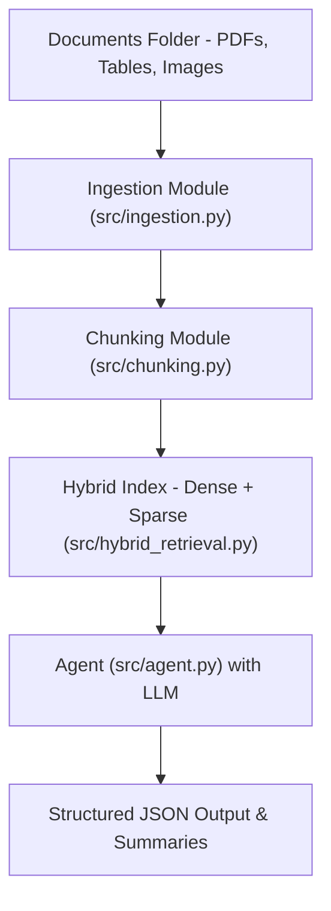

# RAY_AI_CASE_STUDY

## Enterprise Document Intelligence Demo with RAG

This repository demonstrates a **Retrieval-Augmented Generation (RAG)** pipeline for enterprise document analysis using free Hugging Face models. It ingests PDFs, tables, and images, extracts key information, and synthesizes structured outputs. I utilize **microsoft/phi-1_5** LLM to extract relevant insights from the input documents. For improved performance a robust LLM could be used like OpenAI to improve on the output. To ensure that the process is scalable and can handle millions of documents, a high power processor could be used to handle larger chunks of texts and images making it more efficient.
On my 

## Architecture Diagram

## Evaluation Example
I utilized the Case study shared to me by RAY AI to evaluate the performance of my model and the output with regards to the predetermined queries which are:
1. Summarize key product specifications.
2. List numerical data in the report.
3. Identify risks highlighted in the documents.
4. Provide overall insights.
---
